# Qwixx
A Raspberry Pi game made in Angular

## Game options

<!-- OPTIONS:START -->
<!-- Auto-generated by OptionPreviewGeneratorIT (server e2e). Do not edit between these markers;
     run `./scripts/generate-option-docs.sh` to refresh — the pre-push hook regenerates
     and blocks the push if these are stale. -->

### 1. Standard

The standard sheet: cells 2–12 in each colour row.

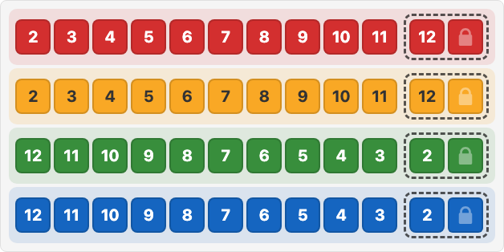

### 2. Longo

The Longo sheet: cells 2–16, ending in bonus numbers.

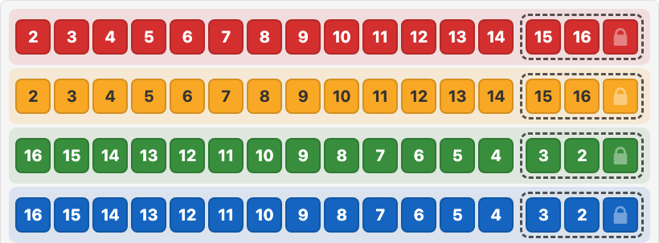

### 3. Big Points

Add two bonus rows. You can cross a cell ONLY when you already have a cross above or below it. A cross in these rows counts for both colored rows. The maximum number of crosses is limited to the amount of cells in a row.

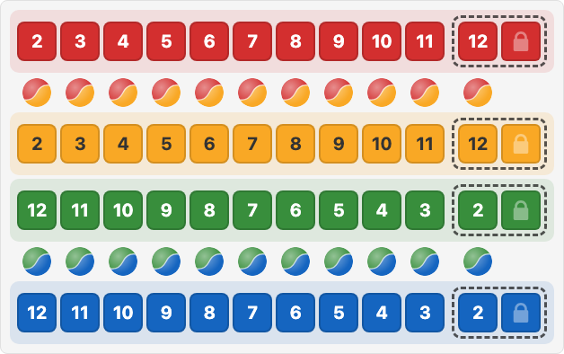

### 4. Random order

Shuffle the numbers within each row.

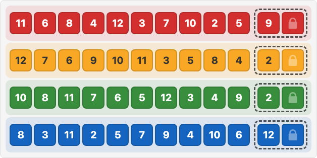

### 5. Extra row

Add a bonus row that forms a wave across the four rows.

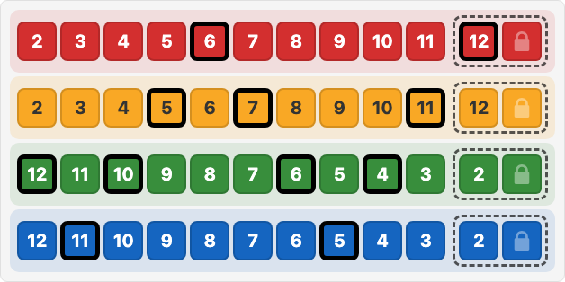

### 6. Connected rows

Links cells between rows: crossing one cell automatically crosses the other cell too.

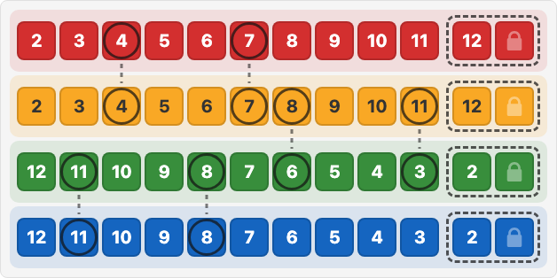

### 7. Connected B

One-way diagonal links: crossing a cell also crosses the cell diagonally below it.

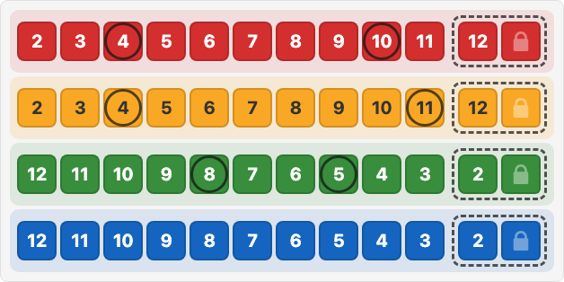

### 8. X-Change

Adds an extra row with the option to change your white+white combination for the other number in that cell.

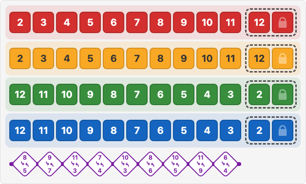

### 9. Lucky Number

Adds a bonus row with 4 bonus points (5, 6, 7, 8). Only the active player can cross this when white die 1 + white die 2 + any colored die equals 15. He can only cross this bonus OR do his regular moves.

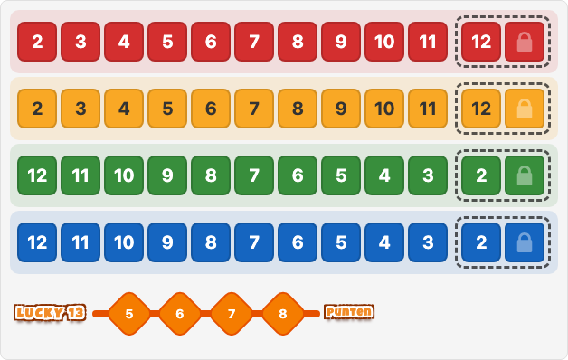

### 10. Lucky Cross

Adds 3 bonus cross fields to each colored row (4 for Longo). When any two dice show a 1 and a 5, every player may cross the next available bonus field once. White+white: free choice of row. White+colored: that colored row. Colored+colored: either of those two rows. Can be used before or after the regular move.

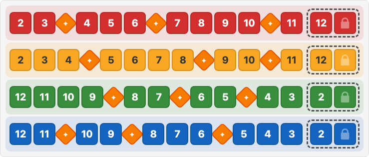

### 11. Double A

Every colored cell gains a smaller twin cell below it in the same row. You may cross the twin once the cell above it is crossed and nothing to its right is crossed yet — an extra cross for the same number.

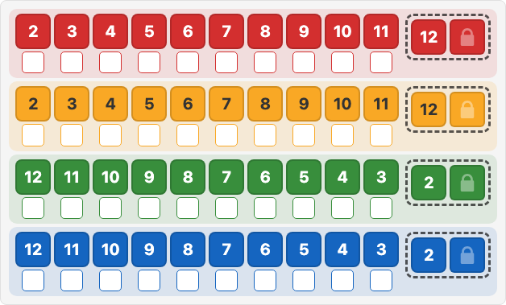

### 12. Double B

A few cells can be crossed off twice.

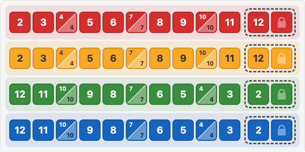

### 13. Bonus A

12 bonus boxes (gold ring) sit in the coloured rows. Crossing one forces you to cross the next cell of the bonus bar below; its colour forces a cross in that row's next box — which can chain. When a row locks, its remaining bonus-bar cells are forfeited.

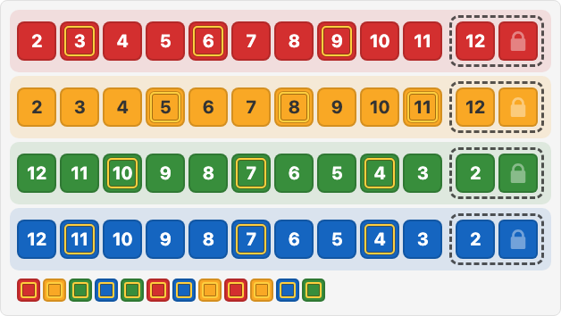

### 14. Bonus B

5 bonuses. Cross each one off twice to earn it.
- 2 crosses in your lowest row
- one cross in every row
- your lowest row's score is doubled
- 13 extra points
- penalty points become 0

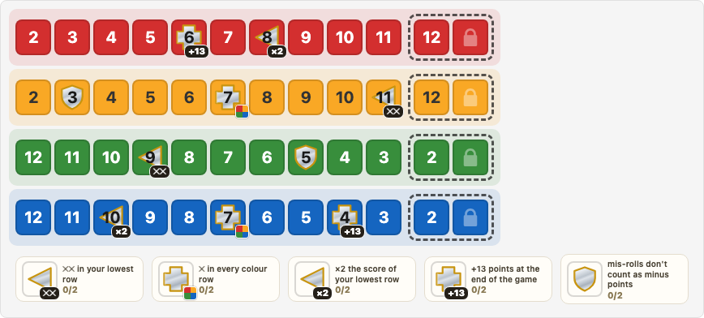

<!-- OPTIONS:END -->

# SSE

Before implementing Server Sent Events the bandwidth was 3kB per poll. Now: after the layout was separated from the mutable data, and SSE was implemented; a game can be played with only sending 300kB in total.

## nginx proxy buffering

When the app runs behind nginx, SSE events are buffered by default and only flushed when the buffer fills or the connection closes. This causes passive players to miss individual game events (e.g. a dice roll) until the next event arrives and flushes the buffer.

Both SSE endpoints (`/gamestates/{sessionId}/stream` and `/games/{sessionId}/lobby/stream`) respond with the header:

```
X-Accel-Buffering: no
```

This tells nginx to disable buffering for that connection and pass each event through immediately. Without this header, players would only see state updates in batches rather than in real time.
